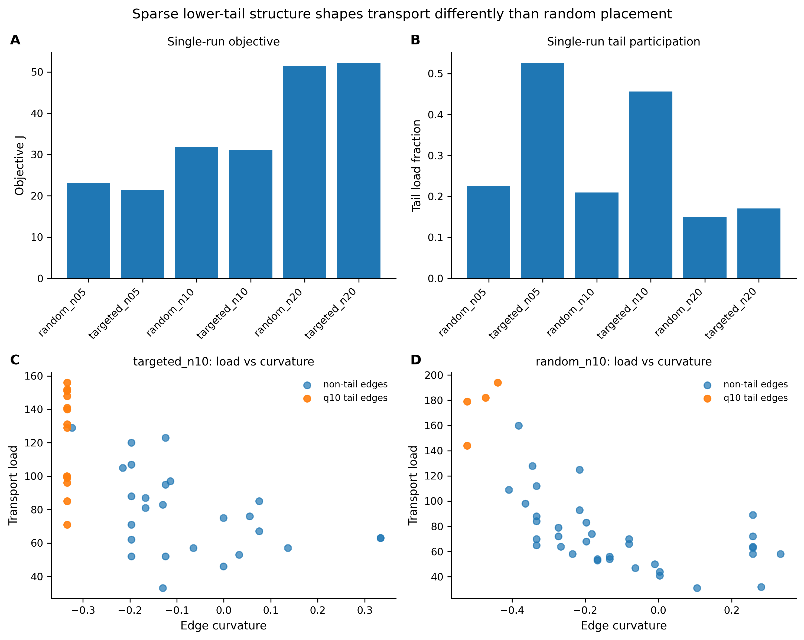

***

# Beyond Mean Curvature: Lower-Tail Routing Structure in Controlled Hierarchical Networks

**Author:** Matthew A. Pender

**Preprint / Zenodo DOI:** [https://doi.org/10.5281/zenodo.19324674](https://doi.org/10.5281/zenodo.19324674)



**Figure 2. Sparse lower-tail structure shapes transport differently than random placement.**
**(A)** Single-run values of the composite objective (J) across targeted and random sparse-placement conditions at three edge budgets. **(B)** Single-run tail load fraction across the same conditions, showing that targeted placement can route a larger share of total traffic through the lower-curvature tail. **(C–D)** Edge-level transport load versus edge curvature for `targeted_n10` and `random_n10`, respectively. In both cases, q10-tail edges bear disproportionate transport load relative to much of the remaining graph, supporting the claim that the lower curvature tail is a genuine load-bearing routing structure. This figure is intended as a proof-of-concept visualization of the mechanism; the stability and regime dependence of these effects are evaluated in the repeated-seed analyses that follow. 

## Overview
This repository contains the complete Python simulation suite, optimal transport logic, and graph-geometric metrics used to generate the results for the paper *"Beyond Mean Curvature: Lower-Tail Routing Structure in Controlled Hierarchical Networks."* 

The codebase simulates thermodynamic and geometric routing constraints on hierarchical networks (balanced trees). By modulating the placement of sparse distal shortcuts (targeted vs. random), it evaluates the network's transport efficiency, maintenance burden, and traffic congestion. The primary finding demonstrated by this code is that optimal routing is not governed by mean curvature alone, but by the specific organization, participation, and burden concentration of the **lower Ollivier-Ricci curvature tail ($q_{10}$)**.

## Dependencies
This project requires Python 3.9+ and the following core libraries:
* `networkx`
* `numpy`
* `pandas`
* `matplotlib`
* `GraphRicciCurvature` (for computing Ollivier-Ricci Curvature)

*Note on ORC computation:* The script `curvature_metrics.py` includes a custom cache-clearing routine and a Windows multiprocessing fallback (`DummyPool`) to prevent memory leaks and state-contamination when computing ORC across thousands of repeated stochastic graph realizations.

## Repository Structure

The repository is organized as follows:

```text
beyond_mean_curvature/
│
├── run_selective_tail_experiment.py     # Main entry point for running simulation configurations
├── aggregate_selective_tail_results.py  # Computes paired-differences & statistics across seeds
├── make_manuscript_figures.py           # Generates figures 1-5 for the paper
│
├── build_thermo_stress_test.py          # Builds the thermodynamic stress-test summaries and ranking table
├── plot_figure6_dissipation_summary.py  # Generates figure 6 for the paper
│
├── experiment_configs.py                # Defines experimental presets (e.g., 'targeted_vs_random')
├── selective_tail_utils.py              # Graph generation, distal candidate generation, and placement
├── transport_metrics.py                 # Wasserstein/Optimal Transport routing and load metrics
├── curvature_metrics.py                 # Graph geometry, ORC calculation, and q10 tail isolation
├── plotting_selective_tail.py           # Raw plotting utilities for diagnostic data
│
└── results/
    └── selective_tail/
        ├── seed_42/                     # Raw CSV, JSON, and diagnostic plots per random seed
        ├── seed_43/                     # ...
        ├── aggregated/                  # Multi-seed CSV summaries and paired-difference error bar plots
        │   └── thermo_stress_test/      # Raw CSV and JSON for the thermodynamic stress-test
        └── manuscript_figures/          # Final paper-ready PNGs (Figure 1 through Figure 5)
```

## How to Replicate the Study

The experimental pipeline is broken into four distinct steps to allow for modular testing, debugging, and visualization.

### Step 1: Run the Core Simulations
To run the primary experiment comparing Targeted vs. Random shortcut placement across multiple edge budgets and random seeds, execute:

```bash
python run_selective_tail_experiment.py
```
*   **What it does:** Reads the `targeted_vs_random` configuration from `experiment_configs.py`. For each seed (e.g., 42-46), it generates the base hierarchical graphs, applies the structural interventions, routes 1,000 source-target pairs, calculates edge loads, computes ORC, and saves the raw telemetry to `results/selective_tail/seed_<X>/csv/`.

### Step 2: Aggregate the Multi-Seed Data
To compute the robust statistical findings and paired differences (eliminating graph-generation noise), execute:

```bash
python aggregate_selective_tail_results.py
```
*   **What it does:** Crawls the individual `seed_<X>` directories, concatenates the results, and calculates paired differences (Targeted minus Random) for metrics like `Tail Efficiency Ratio` ($TER$) and `Tail Burden Concentration` ($TBC$). It outputs summary `.csv` files and diagnostic `.png` error-bar charts to `results/selective_tail/aggregated/`.

### Step 3: Generate Manuscript Figures 1-5
To reproduce the figures used in the final manuscript, execute:

```bash
python make_manuscript_figures.py
```
*   **What it does:** Pulls the specific data points from the aggregated files and specific representative seeds to render the final publication-ready figures, outputting them to `results/selective_tail/manuscript_figures/`. 
*   *Outputs generated include:*
    *   `figure1_conceptual_framing.png`
    *   `figure2_single_run_proof_of_concept.png`
    *   `figure3_multiseed_aggregation.png`
    *   `figure4_tail_organization_metrics.png`
    *   `figure5_regime_diagram.png`

### Step 4: Build and Generate Stress-Test Figure
To reproduce figure 6, first build the data:

```bash
python build_thermo_stress_test.py
```

Then, generate the figure:

```bash
python plot_figure6_dissipation_summary.py
```

## Key Metrics Calculated
The simulation suite tracks several phenomenological and geometric variables defined in the paper:
*   **Composite Objective ($J$):** Balances mean transport cost, active edge maintenance penalty, and max edge congestion.
*   **$q_{10}$ Curvature:** The 10th percentile of the Ollivier-Ricci curvature distribution, identifying the most negatively curved "routing skeleton."
*   **Tail Load Fraction:** The total percentage of macroscopic transport traffic routed exclusively through the $q_{10}$ edges.
*   **Tail Burden Concentration ($TBC$):** The ratio of mean tail-edge load to mean non-tail-edge load, identifying "hot" concentrated exploitation vs. distributed recruitment.

***

### Acknowledgments

During development, Google Gemini and OpenAI ChatGPT were used for brainstorming, structural organization, debugging assistance, and stylistic refinement. Final interpretation, analysis decisions, and manuscript claims remain the responsibility of the author.
